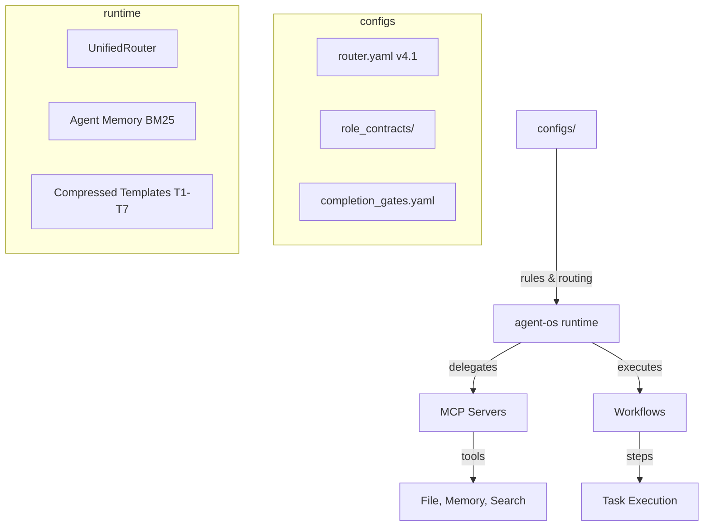

# Agent Onboarding Guide

Руководство по работе с агентной системой Antigravity Core.

## Быстрый старт сессии (обязательно)

Перед любой задачей выполнить:
```
1. Прочитать configs/rules/WORKSPACE_STANDARD.md
2. Запустить adaptation_bootstrap (или /adapt)
3. Проверить readiness_tier — если R2 или ниже, остановиться
4. Выбрать стратегию из session-bootstrap.yaml
```

Readiness tiers: **R5** (прямой старт) → **R3** (загрузить KI) → **R1** (стоп, диагностика)

Подробнее: `templates/adaptation/ADAPTATION_SYSTEM.md` и `docs/ki/ADAPTATION_SYSTEM_V1_2026-04-07.md`

---
## Reliability Platform

Глобальный source of truth для test/debug/reliability теперь вынесен в три контракта:

- `configs/tooling/test_reliability_program.yaml`
- `configs/tooling/test_suite_matrix.yaml`
- `configs/tooling/debug_surface_map.yaml`

Zera command routing is likewise registry-driven:

- `configs/tooling/zera_command_registry.yaml`
- `configs/tooling/zera_client_profiles.yaml`
- `configs/tooling/zera_branching_policy.yaml`

Новые обязательные entrypoints:

- `make test-contract`
- `make test-governance`
- `make test-smoke`
- `make test-unit`
- `make doctor`
- `make reliability-report`

Практика:

1. Перед review или merge запускать минимум `make test-contract`, `make test-governance`, `make test-smoke`.
2. При изменениях runtime/test routing запускать `make test-unit`.
3. При проблемах окружения, doctor surfaces или drift идти через `make doctor`.
4. После падения suite читать `make reliability-report` и артефакты из `outputs/reliability/latest/`.
5. Для Zera-specific routing и branching не полагаться на keyword-only mode routing.

`scripts/run_quality_checks.sh` больше не хранит собственную test-логику. Это thin wrapper над reliability orchestrator profile `pre_commit`.

---
## Архитектура



## Маршрутизация

Единый source of truth: `configs/orchestrator/router.yaml` (v4.1).

**Поток:**
1. Запрос поступает в `UnifiedRouter`
2. Router оценивает сложность задачи
3. Выбирает модель по тиру:

| Тир | Назначение | Пример моделей |
|-----|-----------|----------------|
| C1 | Local/free, простые задачи | ollama/qwen3:4b |
| C2 | Free API, средние задачи | deepseek-v3:free |
| C3 | Balanced, code generation | gemini-2.0-flash |
| C4 | Quality, архитектура | deepseek-r1:free |
| C5 | Premium reasoning | По конфигурации |

## Как добавить роль агента

1. Создайте YAML-файл в `configs/orchestrator/role_contracts/`:

```yaml
role: my_new_role
responsibilities:
  - "Описание обязанности 1"
  - "Описание обязанности 2"
forbidden_from:
  - "Запрещённое действие 1"
  - "Запрещённое действие 2"
```

2. Зарегистрируйте роль в `router.yaml` при необходимости.

Текущие роли: `orchestrator`, `architect`, `engineer`, `reviewer`, `council`, `design_lead`, `routine_worker`.

## Как создать workflow

1. Создайте `.md` файл в `.agents/workflows/`
2. Используйте существующие workflow как образец (например, `genesis.md`, `craft.md`)
3. Workflow должен содержать: triggers, steps, completion criteria

Текущие workflow: 31 файл, от `ai-bot-kb.md` (845 строк) до `model-ab-testing.md` (28 строк).

## Как добавить MCP-сервер

1. Создайте новый workspace в `repos/mcp/servers/src/`
2. Реализуйте tool handlers
3. Обязательно:
   - Path validation (см. ADR-005)
   - Rate limiting
   - Audit logging
   - Input validation по JSON Schema
4. Добавьте тесты
5. Зарегистрируйте в `configs/tooling/mcp_profiles.json`

## Справочник конфигураций

| Путь | Назначение |
|------|-----------|
| `configs/orchestrator/router.yaml` | Маршрутизация моделей (source of truth) |
| `configs/orchestrator/models.yaml` | Реестр алиасов моделей |
| `configs/orchestrator/role_contracts/` | Контракты ролей агентов (7 файлов) |
| `configs/orchestrator/completion_gates.yaml` | Критерии завершения задач |
| `configs/tooling/mcp_profiles.json` | Профили MCP-серверов |
| `configs/rules/WORKSPACE_STANDARD.md` | Стандарт структуры workspace |
| `configs/rules/AGENT_ONLY.md` | Правила для агентов |
| `templates/adaptation/session-bootstrap.yaml` | Протокол инициализации сессии |
| `templates/adaptation/pattern-library.yaml` | Библиотека паттернов (13 шт.) |
| `templates/adaptation/efficiency-dashboard.json` | Метрики эффективности |
| `templates/` | Шаблоны проектов (nextjs, fastapi, telegram, cli, astro, agent-skill) |
| `.agents/templates/compressed/` | Сжатые промпт-шаблоны (T1–T7) |
| `.agents/memory/memory.jsonl` | Агентная память (BM25-indexed) |
| `.agents/workflows/` | Workflow-файлы (31 шт.) |
| `configs/tooling/test_reliability_program.yaml` | Reliability program contract |
| `configs/tooling/test_suite_matrix.yaml` | Suite taxonomy and gate matrix |
| `configs/tooling/debug_surface_map.yaml` | Failure-class triage map |
| `configs/tooling/zera_command_registry.yaml` | Canonical Zera command semantics |
| `configs/tooling/zera_client_profiles.yaml` | Client capability and fallback matrix |
| `configs/tooling/zera_branching_policy.yaml` | Branch lifecycle and merge policy |
| `scripts/run_quality_checks.sh` | Thin wrapper over reliability orchestrator |

## Troubleshooting

**Модель не найдена при маршрутизации:**
- Проверьте `configs/orchestrator/router.yaml` — модель должна быть в списке тиров
- Проверьте `configs/orchestrator/models.yaml` — алиас должен быть определён

**Агент нарушает контракт роли:**
- Проверьте `configs/orchestrator/role_contracts/<role>.yaml`
- Убедитесь, что промпт содержит ссылку на контракт

**MCP-сервер отклоняет запрос:**
- Проверьте rate limit (может быть превышен)
- Проверьте path validation — путь должен быть в пределах разрешённой директории
- Проверьте audit log для деталей отклонения

**Память не находит релевантные записи:**
- BM25 ищет по лексическому совпадению — переформулируйте запрос
- Проверьте `.agents/memory/memory.jsonl` на наличие данных

**Quality checks не проходят:**
- Запустите `make test-contract`
- Затем `make test-governance`
- Затем `make test-smoke`
- Для tooling/env проблем используйте `make doctor`
- Для сводки и путей к артефактам используйте `make reliability-report`
