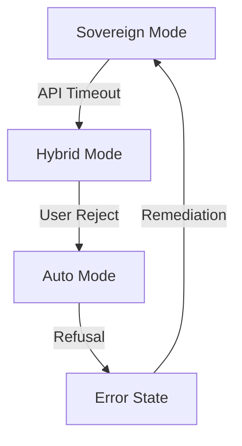

# Zera Capability Graph (v1.0)

## Overview
This document defines the routing and degradation paths for the Zera Persona. It ensures that the agent understands its boundaries and can gracefully transition between autonomous and hybrid execution modes.

## 1. Execution Modes

| Mode | Autonomy | Model Logic | Fallback Path |
| :--- | :--- | :--- | :--- |
| **Sovereign (S1)** | Full | Quality/Reasoning | Hybrid (H1) |
| **Hybrid (H1)** | HITL | Light/Reasoning | Manual |
| **Auto (A1)** | Task-only | Free/Light | Error |

## 2. Capability Matrix

### Analysis & Audit
- **Primary**: `qwen-code` (Quality)
- **Fallback**: `llama-3.1-70b`
- **Constraint**: Must use `trace_validator` for all telemetry analysis.

### Plan Generation
- **Primary**: `claude-3.5-sonnet`
- **Fallback**: `gpt-4o`
- **Constraint**: Must pass `zera-hardening-validator`.

## 3. Degradation Paths

## 4. Persona Routing
All Russian-language intents are routed through the `RU-Intent` layer defined in `zera_command_registry.yaml`. If confidence < 0.8, the system MUST fallback to `triage` workflow.
