# 🌌 ZeRa Evolution Dashboard

> [!NOTE]
> Это центральный узел управления и мониторинга автономного развития ZeRa. Данные обновляются динамически в процессе выполнения циклов `self_evolution_loop.py`.

## 🛰️ Текущее состояние (Status)

```mermaid
graph LR
    A[Observe] --> B[Classify]
    B --> C[Score]
    C --> D[Design]
    D --> E[Sandbox]
    E --> F[Eval]
    F --> G[Promote]
    G --> H[Reflect]
    H --> A
    
    style A fill:#1a1a1a,stroke:#333
    style B fill:#1a1a1a,stroke:#333
    style C fill:#1a1a1a,stroke:#333
    style D fill:#1a1a1a,stroke:#333
    style E fill:#1a1a1a,stroke:#333
    style F fill:#1a1a1a,stroke:#333
    style G fill:#1a1a1a,stroke:#333
    style H fill:#1a1a1a,stroke:#333
```



### Ключевые метрики
- **Репозиторий:** `~/zera`
- **Профиль:** `zera` (локализован)
- **Контроль:** [zera_growth_governance.json](file:///Users/user/zera/configs/tooling/zera_growth_governance.json)
- **Состояние:** [state.json](file:///Users/user/zera/.agents/evolution/state.json)
- **Логи:** [loop.log](file:///Users/user/zera/.agents/evolution/loop.log)

---

## 🛠️ Панель управления (Evolution Control)

> [!TIP]
> Используйте эти команды в терминале для управления процессом.

| Действие | Команда | Описание |
| :--- | :--- | :--- |
| **Start Loop** | `python3 scripts/internal/self_evolution_loop.py` | Запустить бесконечный цикл развития |
| **Dry Run** | `python3 scripts/internal/self_evolution_loop.py --dry-run` | Симуляция цикла без применения изменений |
| **Smoke Test** | `python3 scripts/internal/zera-evolutionctl.py --shadow-smoke` | Проверка целостности теневых профилей |
| **Status** | `python3 scripts/internal/self_evolution_loop.py --status` | Показать текущую фазу и кандидата |
| **Reset** | `python3 scripts/internal/self_evolution_loop.py --reset` | Сброс состояния эволюции |

---

## 📈 Последняя телеметрия (Recent Telemetry)

> [!IMPORTANT]
> Последние 5 событий из [telemetry.jsonl](file:///Users/user/zera/.agents/evolution/telemetry.jsonl).

```dataview
list from "zera/telemetry"
limit 5
```
*(Примечание: Если плагин Dataview не установлен, просматривайте файл напрямую)*

---

## 🧠 Накопленный опыт (Meta-Memory)

- **Scout Journal:** [scout_journal.md](file:///Users/user/zera/.agents/evolution/scout_journal.md)
- **Meta-Memory:** [meta_memory.json](file:///Users/user/zera/.agents/evolution/meta_memory.json)

---
*Generated by ZeRa System Orchestrator | 2026-04-13*
